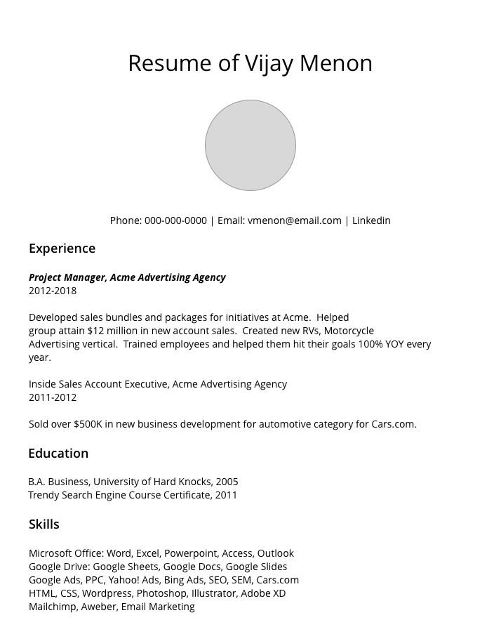

# Build Your Resume (Part I)

Let's build a resume for you using HTML. 

The first thing you will want to do is plan out how your webpage will look.  I call this process the **layout process**.

## Layout

I used to work at an advertising agency, and the first thing we'd do after getting a new order is have someone layout what the ad should look like.  Usually the sales rep would give us something to work with, or they would connect us to someone placing the order from the customer side who would give us a layout.

A layout is just a very simple drawing of what you want your ad to look like.  You can use a paper and pencil to sketch out simple boxes, rectangles, as well as write words and any plain English you want to go along with the layout (called ad copy).  Placement of boxes, rectangles, ad copy is all up to the layout person.  However once the layout is done, it gets handed over to an artist next who creates the actual ad art based on the layout. 

### Create A Layout

Get a pen and paper.  You can find a simple notebook and start sketching out a layout for your resume.  You don't need to be artistic at all to make a layout, if you can draw rectangles and write text, you are good to go.

If you are a little bit more savvy, you can use a tool like Google Slides to make a simple layout digitally.  If you know design, you can make your layout and completely design your entire resume in Photoshop, Illustrator, Sketch -- any app you love.

I'll assume you are like me though and don't know that much about design other than pencil/paper and some basic Google Slides.  (Technically I know Photoshop, Illustrator and Sketch, but using these tools is outside the scope of this masterclass, but we might look at a few things later with specialized tools).

### A Basic Drawing

Here's a layout I came up with.  It's not the world's prettiest but it gets the job done.



### Now You Need To Code It Up

We're skipping the artist part here for now.  We don't need pretty, we just need to have this same layout available as a digital file.   What better file to use than HTML?

#### HTML = LAYOUT 

In the real world, HTML is used to layout webpages by junior web developers.  Often someone will hand a junior developer a Word Document or PDF and say, "turn this into HTML".  A junior developer will have to go through each part of the PDF or Word Document and if they see a paragraph, need to recreate a paragraph in HTML with the same content.   You know to make a paragraph that you need to use a `<p>` opening tag, followed by content, followed by a closing `</p>` tag.

#### Make the HTML page

Using your command line app, navigate to your `Programming` folder:

```
cd /Users/<yourname>/Programming
```

Then **Inside `/Users/<yourname>/Programming`:**, type the following in your command line app.

```
mkdir resume
cd resume
touch index.html
```

We're saying here that we want to make a new folder called `resume`, then change to this folder using the `cd` (change directory) command followed by the folder we want to change to.  Finally inside the resume folder, we say create a new file called `index.html` using the `touch` command.  

Once you are done, open up Visual Studio Code, then navigate over to this same project folder and select `Open Folder`.  As a shortcut, you could also type `code .` from the Command Line, which will open Visual Studio Code up to the same folder containing the index.html file.

From here, open the index.html file inside your Visual Studio Code from the folder and it should show a blank file for you to begin typing in.

### Let's Use Some Boilerplate Code

Paste this boilerplate HTML code that includes syntax for the `<head>` and `<body>` of our HTML page.  You could also write this out by hand if you want the extra practice, which is something I encourage.  

```html
<html>
  <head>
    <title>My Resume</title>
  </head>
  <body>
    <p>Your Resume Goes Here</p>
  </body>
</html>
```

## Converting The Layout

My resume drawing starts with a heading title, "Resume of Vijay Menon".

We know headings can be represented by tags like `<h1>`, `<h2>`, `<h3>` and so on.  Since this title is the most important heading for my webpage, it makes sense to use an `<h1>` tag.

### Make A Header

Let's do that.  Our code now looks like:

```html
<html>
  <head>
    <title>My Resume</title>
  </head>
  <body>
      <h1>Resume of Vijay Menon</h1>
  </body>
</html>
```

Feel free to change `Vijay Menon` with your own name.

Next we have an image of me in the rectangle I drew.  You can find an image of yourself on your computer, and what we will do is put a copy of it in a folder called `images`.

Go to your command line and type the following inside your `resume` folder:

```
mkdir images
```

Open the resume folder in your Windows Explorer or Finder on Mac/Linux.  Open up another folder on your computer so you can get to the photo you want to copy.  For example you can take a picture with your phone, select it from your Photos app, then send it via Airdrop or Beam it to your Windows Downloads folder.  With Mac, Airdrop will also save the photo into the Downloads folder.  In either case, try to send your photo to your Downloads folder, so you can right click on it, then copy the photo and paste it into your images folder in your resume.

### Add an image

Now we need to make an image tag back in our html.  To do so, we use the `` tag syntax.

Remember an image needs some url fed to its `src` (source) property for an image to display properly.  Since our images folder is in the same folder as our `index.html` file, we can just write ``.  We'll also give the `` tag an `alt` property so if a search engine were to read our webpage, the robot could understand what this image is about and add it to its database.

```html
    
```

Here we don't need to write `https` or `https://www.images/myphoto.png` because this file is LOCAL to our folder, meaning our browser will look for the folder `images` as it is relative to the `index.html` file.  Since the `index.html` file and the `images` folder are in the same folder -- this is an easy job for the browser to find the image of you and show it in the `` tag.   

Compare this with having to write a full URL like in our previous chapter, where we used the Unsplash site to add in an image from the web.  If the image is not available in a local folder, you will need to provide an ABSOLUTE PATH (aka full URL) so the browser can get to it.  Without an absolute path, your image will not display and show a default missing image icon which the browser will supply.   

We'll talk a lot more about LOCAL vs ABSOLUTE paths (urls) in upcoming chapters, but for now these are the basics. 

Our code now looks like:

```html
<html>
  <head>
    <title>My Resume</title>
  </head>
  <body>
      <h1>Resume of Vijay Menon</h1>
      
  </body>
</html>
```

### Let's add our contact info as another paragraph, and let's add links

We can add another paragraph tag `<p>` under our image and write in some information about how to contact us.  I made my email and my Linkedin profile linkable by adding `<a>` tags.  

```html
<p>Phone: 000-000-0000 | Email: <a href="mailto:vmenon@email.com">vmenon@email.com</a> | <a href="https://linkedin.com">Linkedin</a></p>`
```

You'll notice that with my email, rather than using `https://someurl.com` like we usually do for a link, I'm using `mailto:` instead, followed by my email.   This special code snippet will make any link an email link instead of a url link, which when clicked on will open the default Mail program and send an email to whatever email supplied: aka `mailto:vmenon@email.com`.  Neet trick!

Our code now looks like:

```html
<html>
  <head>
    <title>My Resume</title>
  </head>
  <body>
      <h1>Resume of Vijay Menon</h1>
      
      <p>Phone: 000-000-0000 | Email: <a href="mailto:vmenon@email.com">vmenon@email.com</a> | <a href="https://linkedin.com">Linkedin</a></p>
  </body>
</html>
```

### Add sub-headings for Experience, Education & Skills

These are going to be `<h2>` or `<h3>` tags because we want sub-headings.  Our main heading is already in use with an `<h1>` tag.  Let's put these under the `` tag we just made.  For simplicity, let's use `<h2>` tags.

Our code now looks like:

```html
<html>
  <head>
    <title>My Resume</title>
  </head>
  <body>
      <h1>Resume of Vijay Menon</h1>
      
      <p>Phone: 000-000-0000 | Email: <a href="mailto:vmenon@email.com">vmenon@email.com</a> | <a href="https://linkedin.com">Linkedin</a></p>
      <h2>Experience</h2>
      <h2>Education</h2>
      <h2>Skills</h2>
  </body>
</html>
```

### Fill in the content

Most of this part is just going to be making simple `<p>` paragraph tags and filling them with content about our experience, education and skills.  You might want to use additional tags like `<ul>` to make a list, or `<br />` to separate line breaks.  You might even want to use more sub-headings like `<h3>` to make content more organized.  

In any case, let's add in all the content from our layout above.  Feel free to write your own content and really elaborate.

Our code now looks like:

```html
<html>
  <head>
    <title>My Resume</title>
  </head>
  <body>
      <h1>Resume of Vijay Menon</h1>
      
      <p>Phone: 000-000-0000 | Email: <a href="mailto:vmenon@email.com">vmenon@email.com</a> | <a href="https://linkedin.com">Linkedin</a></p>
      <h2>Experience</h2>
      <h3>Project Manager, Acme Advertising Agency</h3>
      <p>2012-2018</p>
      <p>Developed sales bundles and packages for initiatives at Acme.  Helped group attain $12 million in new account sales.  Created new RVs, Motorcycle Advertising vertical.  Trained employees and helped them hit their goals 100% YOY every year.</p>
      <h3>Inside Sales Account Executive, Acme Advertising Agency</h3>
      <p>2011-2012</p>
      <p>Sold over $500K in new business development for automotive category for Cars.com.</p>
      <h2>Education</h2>
      <p>B.A. Business, University of Hard Knocks, 2005
      <br />Trendy Search Engine Course Certificate, 2011</p>
      <h2>Skills</h2>
      <ul>
        <li>Microsoft Office: Word, Excel, Powerpoint, Access, Outlook</li>
        <li>Google Drive: Google Sheets, Google Docs, Google Slides</li>
        <li>Google Ads, PPC, Yahoo! Ads, Bing Ads, SEO, SEM, Cars.com</li>
        <li>HTML, CSS, Wordpress, Photoshop, Illustrator, Adobe XD</li>
        <li>Mailchimp, Aweber, Email Marketing</li>
      </ul>
  </body>
</html>
```

## You've Got The Layout, Now It's Time To Flesh It Up.

Okay, so end of this section.  We have essentially translated our pencil/paper layout to layout in code.  In a sense, you could share this resume to your friends, coworkers and new businesses that you might want to apply to, but I'm pretty sure you wish this resume had a little more style.  It sure is basic.

That's exactly what we are going to do next; make the resume pretty.  It's time to be an artist!  If you are a designer, this is probably going to be the part you love the most.  If you're not a designer, and cannot draw to save your life, don't worry -- I'll give you some basic ideas as to how to at least fake you know what you are doing.   I also started off not knowing anything about design, but over the years I've picked up what works and what doesn't, especially if I had to improvise when we didn't have budgets for a designer.   Knowing how to do some basic design yourself will help you be an all around better web developer.

After the design section and a little bit more work on organization with HTML, we'll jump into CSS, which will be the next language we will focus on in learning web development.  CSS (Cascading Style Sheets) are programmatic rules you write for a webpage you create in HTML that style the page.  We'll see how CSS works very shortly!  Stay tuned!


## Homework

- Make a resume for yourself now that you have finished this tutorial
- Really work to make your resume as detailed and organized as possible.  Feel free to experiment with more tags, especially list tags `<ul>`, `<ol>`, as well as more sub-headers, `<h4>`, `<h5>` and images ``.  
- See if you can jump ahead and learn about semantic HTML5 tags like `<section>`, `<nav>`, `<article>`, and `<aside>`.   We will learn those tags though too in upcoming lessons.  