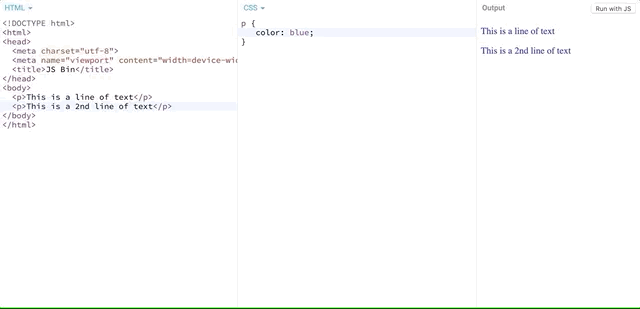

# Improving Our Resume With Design

Using the advice I gave you in the last section, I've put together a resume design.  That said, I know many of you are still beginners, so I am keeping my design basic enough to replicate for newbies, while giving those more design inclined the chance to do their own thing.  So if you are really good at design, go and make your resume look fantastic!  Just be sure you can code it too!  

If you want to use my basic design for now, you can and when you are ready to make your resume look even better (after this masterclass), feel free to really spruce it up.


## How Do We Code This?

Now that we have our design, you might be wondering to yourself how to turn the HTML layout you made earlier into code that looks like this design.  One thing's for sure, I have not taught you how to color anything yet.  

## Let's Talk About CSS

CSS, or Cascading Style Sheets (as they are called), is a language used to style pages made in HTML.  While HTML is used primarily for **layout**, CSS is used primarily for **style**.

The first thing to note about CSS is that its syntax is DIFFERENT from HTML.  

While HTML is just markup around plain English, CSS is more like a list of rules you write out.  

Let's look at some basic syntax for CSS:

```css
p {
   color: blue;
}
```

What we are saying here essentially is that ANY TIME we have a `p` tag in our HTML, we want to give it a `color` property of `blue`.  That's why the paragraph you see above is `blue`.

What if we want to change the color?

```css
p {
    color: red;
}
```




This line of code now changes all paragraphs to `red` color in our body.

A rule is created by writing the name of the element (called a selector) followed by an opening bracket `{`, followed by the property (or properties) you want to set values for (e.g. `color`:`red`), followed by a `;` to indicate the end of a statement (like in English how a period `.` ends a sentence), followed by a closing `}` bracket.

It's very important to get the syntax correct when writing CSS.  Unlike HTML, if you write CSS incorrectly, the browser will NOT attempt to fix it for you.  The incorrect CSS syntax will just be ignored.

```css
p (
    color red
)
```

In this rule above^, the **CSS is INCORRECT**.  Take a moment to think why.

**Answer**: The rule uses an opening `(` instead of a `{` which is the first error.  You'll also notice that there is no `:` separating the property `color` from its value `red`.  The `red` value is also missing a semicolon `;`.   

Ultimately, this BAD code will just get ignored when the browser attempts to read the CSS rule.  This CSS rule set is NO GOOD.

```css
p ]
 red: color;
[
```

**Can you tell what's wrong with this CSS rule set?**

If you guessed the brackets were wrong, good for you! We should have curly brackets that open and close `{` `}`, not brackets that close and open `]` `[`.

**What else do you see wrong?**

`red` is now in front of `color`.  That doesn't make sense.  Properties like `color` should have values like `red` and in that order, not the other way around where values have properties.


## Write your CSS Inside a `<style>` Tag

One way you can use CSS immediately with your own webpage is to create a `<style>` tag in your HTML like so:

```html
<style>
    p { 
        color: red;
    }
    h1 {
        color: green;
    }
    table {
        color: purple;
    }
</style>
```

Your `<style>` tag must have a closing tag since CSS is written in between the opening and closing tags.  Not closing your `</style>` tag may lead to the webpage to look broken or styled incorrectly (sometimes referred to as a quirk).   

Typically, the `<style>` tag goes inside the HTML `<head>` tag.   While you can place the `<style>` tag inside the body of a webpage too, for organization purposes, it makes sense to put styles for a webpage in the `<head>` since the `<head>` is where we store information about a page yet to be loaded, while the `<body>` is for actual layout.  We'll talk more about this concept in later chapters.

Here is sample HTML output with a `<style>` tag in the `<head>`.  If you want to practice with CSS a little bit, try changing the colors in this example below.   Simply create a folder called `chapter-07-css`, then change directory to it `cd`, then create a new file called `index.html`.  Paste this code in that `index.html` file, save, then find this same file and open it with your browser to see the result.

```html
<!doctype html>
<html>
  <head>
    <title>This is the title of my webpage</title>
    <style>
        p { 
            color: red;
        }
        h1 {
            color: green;
        }
        table {
            color: purple;
        }
    </style>
  </head>
  <body>
    <p>This is my webpage</p>
  </body>
</html>
```

### Notes On Indentation With CSS

Indentation for CSS is similar to HTML.  While we don't need to have indentation around our CSS, it makes for good readability.

Technically you can write CSS like this:

```css
p{color:red;}
```

Some people like to write CSS without spaces, so long as their syntax is correct -- it will work.  However, as the CSS gets more detailed, especially if we add in syntax for font sizes, font families, background colors, gradients -- you might have code that looks like this:

```css
p{color:red;background-color:black;font-family:"Helvetica",serif;font-weight:bold;}
```

This will still work, but just looks ugly.  By indenting, we can make this code easier for us to read and undertand.

```css
p {
    color:red;
    background-color:black;
    font-family:"Helvetica",serif;
    font-weight:bold;
}
```
^Easier to read.

## To Review

Always use correct syntax when writing CSS.  Use correct syntax when working with any computer language in general, because the computer takes everything written by you, the human literally.

If you make a mistake, CSS and HTML will "autocorrect" on your behalf, but not in the way you might want.  CSS mistakes are IGNORED, so your rule set will not get applied to the HTML you wrote.   

Use indentation to make it easier for yourself to read and write CSS.  

## Let's Keep Going

Now that you have a basic idea of how to use HTML and CSS, let's work on our resume together.  We'll use the design I have for my resume as a guide.  Later, in homework -- you can work on your own resume and use the ideas I've given you to layout and style it yourself.

- Let's start our project in the next chapter.  See you there!

## Homework

Check out the following HTML and CSS code below.   Can you identify what might be wrong with these code snippets? How would you fix the snippet so it works in a browser properly (the way you specified)?

Use your command line to make a folder called `Chapter-07` inside your `Tutorials` folder.  Then make one more folder inside called `homework`. Put all your homework code into this folder.  So you should be working inside a project structure like this.  

`~/Tutorials/Chapter-07/homework`

### Snippet 1

```html
<!doctype html>
<html>
<title>My Website</title>
<body>
<p>This is my website<p>
</body>
<html>
```

Make a new HTML page called `snippet1.html`.  Paste this code into your `snippet1.html`, save, then open the file with your browser after finding the file in your project folder. What do you notice about this HTML?  Is it valid syntax or do you think it's broken?  How could you fix the code?

### Snippet 2

```html
<!doctype html>
<html>
<head>
    <title>My webpage</title>
</head>
<body>
p {
    color:green;
}
<p>Hello</p>
</body>
</html>
```

Make a new HTML page called `snippet2.html`.  Paste this code into your `snippet2.html`, save, then open the file with your browser after finding the file in your project folder. Why isn't the paragraph green? How could you fix this code?


### Snippet 3

```html
<!doctype html>
<html>
  <head>
    <title>This is the title of my webpage</title>
    <style>
        p ( 
            color: red;
        )        
    </style>
  </head>
  <body>
    <p>This is my webpage</p>
  </body>
</html>
```
Make a new HTML page called `snippet3.html`.  Paste this code into your `snippet3.html`, save, then open the file with your browser after finding the file in your project folder. Why isn't this paragraph red?  How could you fix the code?