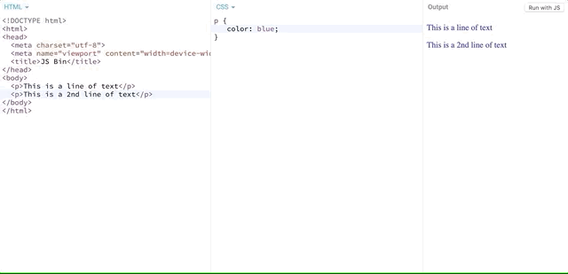

# Improving Our Resume With Design

Using the advice I gave you in the last section, I've put together a resume design.  That said, I know many of you are still beginners, so I am keeping my design basic enough to replicate for newbies, while giving those more design inclined the chance to do their own thing.  So if you are really good at design, go and make your resume look fantastic!  Just be sure you can code it too!  

If you want to use my basic design for now, you can and when you are ready to make your resume look even better (after this masterclass), feel free to really spruce it up.


## How Do We Code This?

Now that we have our design, you might be wondering to yourself how to turn the HTML layout you made earlier into code that looks like this design.  One thing's for sure, I have not taught you how to color anything yet.  

## Let's Talk About CSS

CSS, or Cascading Style Sheets (as they are called), is a language used to style pages made in HTML.  While HTML is used primarily for **layout**, CSS is used primarily for **style**.

The first thing to note about CSS is that its syntax is DIFFERENT from HTML.  

While HTML is just markup around plain English, CSS is more like a list of rules you write out.  

Let's look at some basic syntax for CSS:

```css
p {
   color: blue;
}
```

What we are saying here essentially is that ANY TIME we have a `p` tag in our HTML, we want to give it a `color` property of `blue`.  That's why the paragraph you see above is `blue`.

What if we want to change the color?

```css
p {
    color: red;
}
```




This line of code now changes all paragraphs to `red` color in our body.

A rule is created by writing the name of the element (called a selector) followed by an opening bracket `{`, followed by the property (or properties) you want to set values for (e.g. `color`:`red`), followed by a `;` to indicate the end of a statement (like in English how a period `.` ends a sentence), followed by a closing `}` bracket.

It's very important to get the syntax correct when writing CSS.  Unlike HTML, if you write CSS incorrectly, the browser will NOT attempt to fix it for you.  The incorrect CSS syntax will just be ignored.

```css
p (
    color red
)
```

In this rule above^, the CSS is INCORRECT.  The rule uses an opening `(` instead of a `{` which is the first error.  You'll also notice that there is no `:` separating the property `color` from its value `red`.  The `red` value is also missing a semicolon `;`.  (Again, it's like forgetting to end your sentence with `.` in English.) 

Ultimately, this code will just get ignored when the browser attempts to read the CSS rule.  This CSS rule set is NO GOOD.

```css
p ]
 red: color;
[
```

Can you tell what's wrong with this CSS rule set?  

If you guessed the brackets were wrong, good for you! We should have curly brackets that open and close `{` `}`, not brackets that close and open `]` `[`.

Again syntax is super important!  

What else do you see wrong?  

`red` is now in front of `color`.  That doesn't make sense.  Properties like `color` should have values like `red` and in that order, not the other way around where values have properties.

If this still feels a bit alien to you, you'll catch on with time as we work together.   The point for now is that CSS is about RULE SETS.  HTML is just markup to decorate English.  Good so far?

## Let's Keep Going

Now that you have a basic idea of how to use HTML and CSS, let's work on our resume together.  We'll use the design I have for my resume as a guide.  Later, in homework -- you can work on your own resume and use the ideas I've given you to layout and style it yourself.

Let's start our project in the next chapter.  See you there!